# myo-readings-dataset

    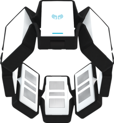
    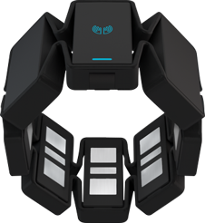

Conjunto de datos para aprendizaje automático con registros de EMG del brazalete Myo que corresponden a los gestos de la mano de hibernación, flexión, extensión, desviación radial, desviación cubital, pronación, supinación y puño.

## Ejemplo de resultados (matriz de confusión)

    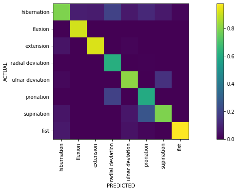

## Estructura del proyecto ##
Las lecturas de la mano derecha se encuentran en la carpeta `_readings_right_hand`, mientras que las lecturas de la mano izquierda están en la carpeta `_readings_left_hand`, y ambas contienen una carpeta por sesión de grabación. ***Todas las carpetas de sesiones que contengan datos del mismo participante deben nombrarse con un identificador único aleatorio (cinco dígitos), seguido de un guion y el número de sesión, comenzando en 1 (por ejemplo, 12345-1, 12345-2, etc.).*** Cada carpeta de sesión contiene varios archivos, uno por cada gesto de muñeca. Estos se nombran como `<label>.txt` (p. ej., `2.txt` para extensión, véase las etiquetas de gestos a continuación). Cada carpeta de sesión de grabación debe contener al menos ocho archivos (para los gestos 0-7). Se espera que se graben tres sesiones en la mano derecha o en la mano izquierda.
El archivo en sí está compuesto por varias líneas:

    ...
    11,32,-3,-43,4,5,42,7,0
    13,24,-5,12,43,42,12,1,0
    123,121,-100,-88,-32,32,123,13,2
    ...

Cada línea representa las muestras de los ocho canales de EMG del brazalete Myo (***[-128, 127]***, byte con signo), así como la etiqueta del gesto de muñeca (clase) en un momento dado, separados por comas. ***No debe haber una coma al final de la línea y no debe haber espacios en ninguna parte del archivo.*** La frecuencia de muestreo es aproximadamente de 200 Hz, según las especificaciones del Myo. En este ejemplo, las dos primeras líneas representan hibernación (p. ej., 0 al final de la línea), mientras que la tercera línea representa extensión (p. ej., 2). Los valores de EMG son arbitrarios en el ejemplo. ***No debe haber una línea vacía al final del archivo.***

## Protocolo de grabación
El brazalete Myo se coloca en la parte más gruesa del antebrazo, con el ***LED apuntando hacia la parte dorsal (posterior) de la mano***.
Cada archivo contiene un minuto de grabación y debe tener ***alrededor de 12 000 líneas*** (~200 Hz &times; 60 s = 12 000). ***Las etiquetas al final de las líneas alternan entre hibernación (0) y el gesto indicado en el nombre del archivo cada cinco segundos.*** La excepción es el gesto de hibernación, donde el archivo solo debe contener etiquetas de hibernación (0) al final de las líneas. Las grabaciones de hibernación contienen diversos movimientos y gestos leves de la mano que preferiríamos ignorar durante la clasificación.

## Etiquetas de gestos
* 0: hibernación

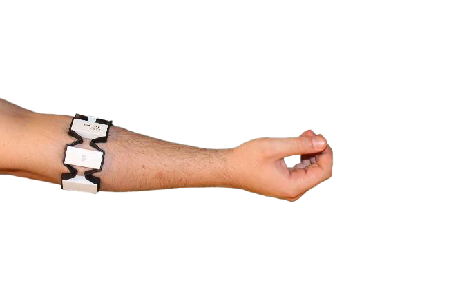
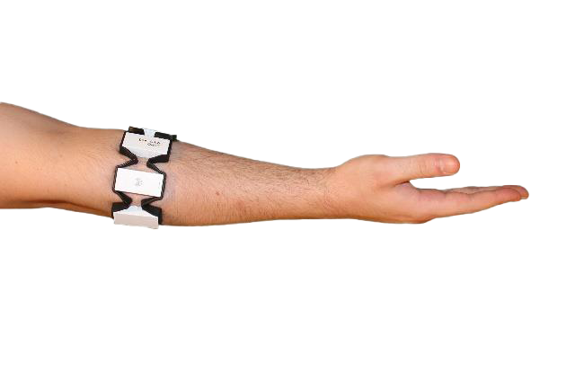

* 1: flexión

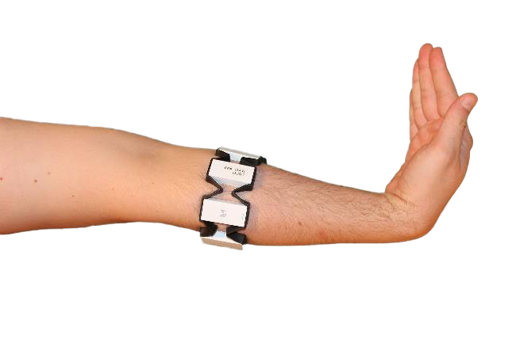

* 2: extensión

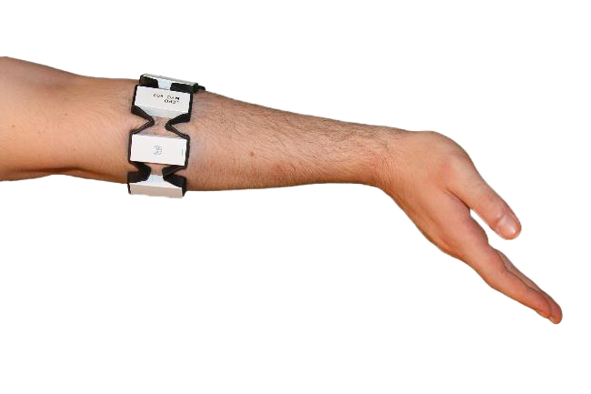

* 3: desviación radial

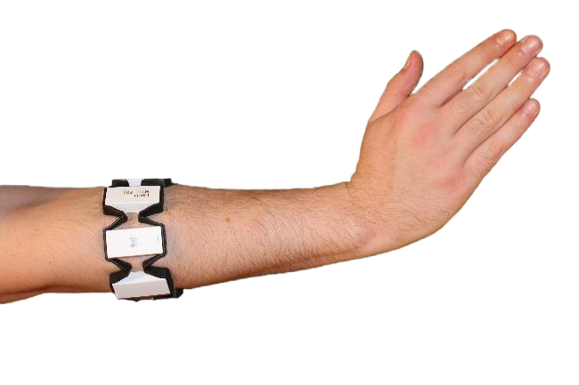

* 4: desviación cubital

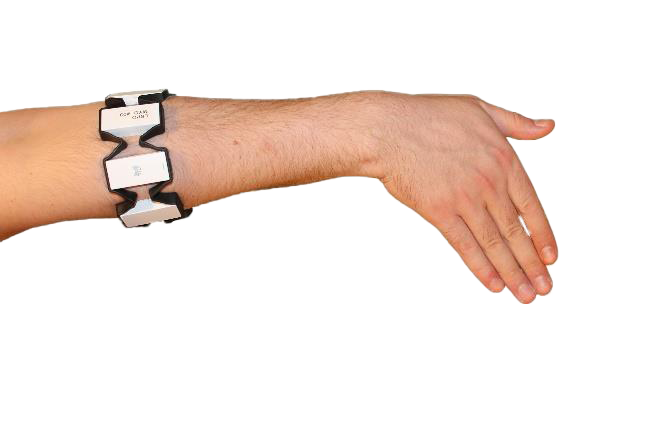

* 5: pronación

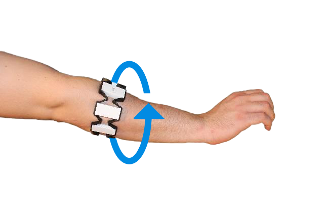

* 6: supinación

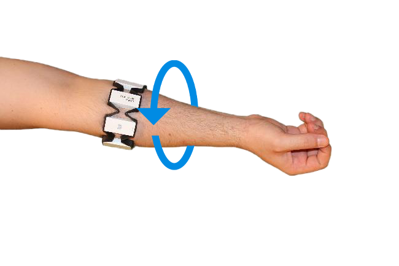

* 7: puño

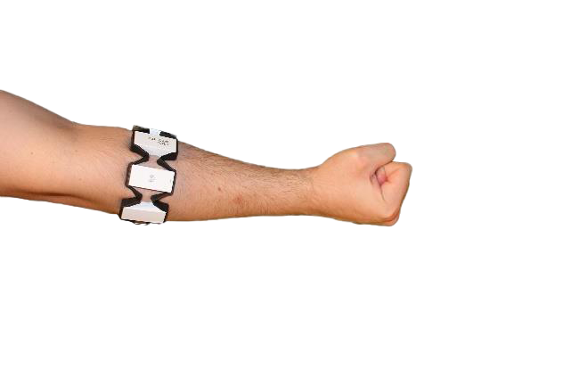

## Sesiones curadas
El archivo `curated.txt` contiene una lista de sesiones que ofrecen una precisión intra-participante aceptable para la mayoría de los gestos al aplicar estrategias de aprendizaje automático para evaluar el conjunto de datos.
Una buena precisión intra-participante indica una correcta colocación de los electrodos y la orientación del dispositivo durante las sesiones de grabación individuales de un único participante.
Por lo tanto, las sesiones curadas también ofrecen una buena precisión inter-participante.
Si tiene la intención de utilizar el conjunto de datos para aplicar estrategias de aprendizaje automático, se recomienda utilizar solo las sesiones curadas.

## Ejemplo de contenido de un solo archivo

    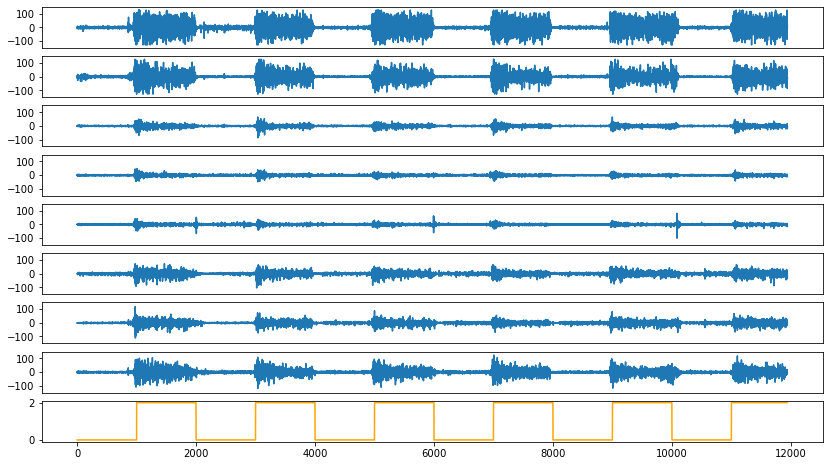

Los gráficos anteriores muestran medidas de EMG de una sola mano que realiza repetidamente la extensión durante un minuto. La línea naranja muestra el gesto actual, que alterna entre hibernación (0) y extensión (2).
